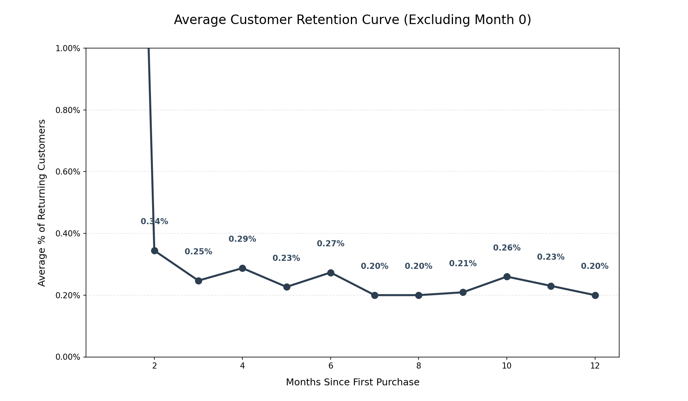
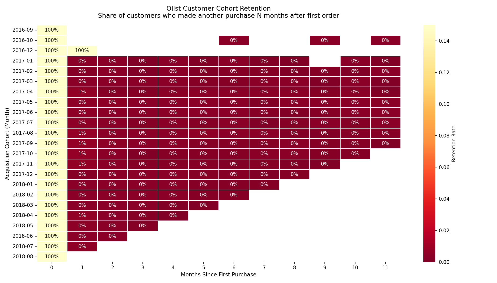

# Olist Product Analysis

A product analytics case study built on Olist's real Brazilian
e-commerce dataset (99,441 orders, 2016–2018). Structured as if
embedded in Olist's product team, the goal is not to describe the
data, but to answer a real business question:

**Why did growth stall, and where did the customer experience break down?**

> Retention is effectively zero beyond the first purchase, a structural, not seasonal, problem.

---

## Key Findings

| Finding | What the data says |
|---|---|
| Funnel health | 97% delivery rate. Not the problem. |
| Month-1 retention | 0.34% average across all cohorts |
| Retention by month 3 | ~0.20% - flatlines and never recovers |
| Highest AOV category | `computers` at $1,252 avg - 8x platform average, 176 orders in 2 years |
| Consumable category share | Under 2.5% of total orders |

Full analysis in [FINDINGS.md](./FINDINGS.md).

---

## The Three Analyses

### 1. Purchase Funnel Drop-off (`sql/funnel_analysis.sql`)
Classifies every order by the furthest stage it reached
(placed → approved → with carrier → delivered), measures
late delivery rates, and breaks completion rates by Brazilian state.

**Key finding:** 91.9% of delivered orders arrived early, but
this reflects deliberate delivery date padding, not genuine speed.
True late delivery affected 6.8% of orders. No regional failure
identified. The 3% stall rate happens at payment approval,
not last-mile.

### 2. Cohort Retention (`python/cohort_retention.py`)
Builds a month-over-month cohort retention matrix using
`customer_unique_id` to correctly identify returning customers
across Olist's relational table structure. Outputs two charts:
a heatmap showing retention by acquisition cohort, and a
retention curve showing the platform-wide average.

**Key finding:** Month-1 retention averages 0.34% and
shows no recovery across cohorts at ~0.20% through month 12. Pattern is consistent
across every cohort with no exceptions. Cause is category mix
(durable goods dominate), not customer dissatisfaction
(38 of 52 categories score above 4.0/5.0).

### 3. Segment Performance (`sql/segment_analysis.sql`)
Compares 52 product categories and 4 payment types across
average order value, review score, freight cost, and
installment usage. Flags segments above and below platform average.

**Key finding:** `computers` at $1,252 avg order value and
`small_appliances` at $321 are high-satisfaction, high-AOV
categories with minimal order volume never scaled.
Consumable categories (food, drinks, pet) sit under 2.5%
of orders despite being the only ones capable of driving
repeat purchase behaviour.

---

## Expected Business Impact

- Increasing consumables share from 2.5% → 5% could meaningfully improve repeat purchase rates
- Targeted cross-sell experiments could lift 60-day retention above the ~0.3% baseline
- Expanding high-AOV categories may increase GMV without requiring user growth

---

## Charts

**Cohort Retention Heatmap** - each row is an acquisition cohort,
each column is months since first purchase. Dark red = near-zero retention.


---

## Tools and Why

| Tool | Used for | Why not something else |
|---|---|---|
| SQL + DuckDB | Funnel and segment analysis across 6 joined tables | Set-based aggregation is cleaner in SQL than pandas for this type of multi-table join |
| Python (pandas) | Cohort matrix construction | Pivoting and period arithmetic require pandas — SQL can produce the numbers but not the matrix shape |
| Seaborn + Matplotlib | Heatmap and retention curve | Standard Python visualisation stack; output is reproducible and version-controlled |

---

## Setup
```bash
git clone https://github.com/Sam4larin/olist-product-analysis.git
cd olist-product-analysis
conda create -n olist-analysis python=3.11
conda activate olist-analysis
pip install -r requirements.txt
```

Download the dataset from
[Kaggle — Brazilian E-Commerce by Olist](https://www.kaggle.com/datasets/olistbr/brazilian-ecommerce)
and place the 7 CSV files in `data/`.
```bash
python scripts/run_all.py
```

Outputs save to `outputs/tables/` (CSV) and `outputs/charts/` (PNG).

---

## Folder Structure
```
olist-product-analysis/
├── assets/                        # cohort_retention_heatmap.png, retention_curve.png
├── data/                          # Raw CSVs (not tracked in git)
├── sql/
│   ├── funnel_analysis.sql        # Purchase funnel + late delivery + regional
│   └── segment_analysis.sql      # Category and payment segmentation
├── python/
│   └── cohort_retention.py       # Cohort table + heatmap + retention curve
├── outputs/
│   ├── charts/                   # cohort_retention_heatmap.png, retention_curve.png
│   └── tables/                   # CSV results for all analyses
├── scripts/
│   └── run_all.py                # Single entry point - runs everything
├── FINDINGS.md                   # Analyst memo: findings, recommendation, limitations
├── requirements.txt
└── README.md
```